# Deliverable 3: **Performance Report**

**Project:** 
Predict student risk tier (Low / Medium / High) based on early course data. 
**Dataset:** 
OULAD (Kaggle: Student Demographics Online Education Data)  
**Prediction Time:** 
Week 14 (Day 98) which is almost half-time for courses in the dataset
**Label Horizon:** 
End-of-course outcome (Pass / Fail / Withdrawn → mapped to risk tier)  
**Date:** December 26, 2025

## 1. Executive Summary

### 1.1. Context

This report summarizes the model performance for an **early‑warning classification system** that predicts a student’s **Risk Tier** (Low / Medium / High) using course progress data, demographic characteristics, assessment metrics, and virtual learning environment (VLE) activity up to a cutoff day which is defined as the number of days from the course offering start until a set point in time that is meant to be the "early period" (this solution uses 14 weeks, which are 98 days, since courses are over 220 days at the Open University and that's about half of the course).

### 1.2. Methodology Overview

This project followed a standard classification workflow with leakage checks:

1. Based on an early-warning cutoff as a number of days from the coruse start (which can be changed) the solution is restricted to data available before that point in time to avoid leakage (Figure 2).  
2. Engineer features from assessments and VLE activity and try to address missing values and skews (the data doesn't have normal distributions).  
3. The dataset is used to create a train/test split with class balance checks.  
4. Setting a benchmark a dummy baseline to set the minimum acceptable result.  
5. Develop two models (see sequence in section *1.3. Models Explored*).
6. Model comparison followed by tuning using cross-validation. 
7. Selecting the best model by a set of defined scoring metrics (shared across the project).  
8. Final evaluation on held-out test data that the model did not "see" before, with error analysis and “High Risk vs Rest” diagnostics.  
9. Interpret the results and identify feature importance to explain what signals drive predictions.

### 1.3. Models Explored

1. **Dummy baseline** (the baseline predicted the majority class)
2. **Logistic Regression (default)** 
3. **Random Forest (default)**
4. **Tuned Logistic Regression** (using grid search)
5. **Tuned Random Forest** (using random search) 

The **best model** ended being the tuned Random Forest (based on the best CV macro F1)

### 1.4. Insights

The model is good at identifying Low Risk learners (also the majority class), but doesn't perform well with High Risk detection. This shows up clearly in the evaluation stage of the model, where the model provides useful ranking compared to baselines or chance but still misses a meaningful portion of High Risk learners.

### 1.5. Recommendations

This model can be used as an initial triage tool for a priority queue for outreach to learners, but it is not robust enough as an automated decision-maker for identifying potential learners who might struggle or withdraw from a course.

However, paired with human review and transparent criteria (e.g., staff review of the top-N High Risk probabilities each week) per specific course offerings can speed up outreach efforts, especially in course offerings with hundreds of learners.

## 2. Data Use

### 2.1. Data Source and Structure

The dataset is built by joining multiple datasets from the [Open University Learning Analytics Dataset (OULAD)](https://www.kaggle.com/datasets/anlgrbz/student-demographics-online-education-dataoulad). that contain tables with student information and course performance for each student (courses, student demographics, assessments, VLE activity). 

#### Additional Resources:

- **Table 1** (`table_01_raw_file_inventory_md5.csv`) lists all raw files and checksums for data integrity.  

- **Tables 2**  (`table_2_data_dictionary_snapshot.csv`) provides an initial snapshot of the data (the more detailed version is available in the Data Dictionary file `01_DATA_DICTIONARY`.

- **Tables 3**  (`table_3_assessment_features_early_summary.csv`) lists the structure of the assessment features which were deemed important during the evaluation.

- **Tables 4**  (`table_4_vle_features_early_summary.csv`) lists the structur of the VLE, which is the learning environemnt, which were also deemed important during the evaluation.

- **Table 5** (`table_5_missingness_summary.csv`) lists missing values in the used tables in the raw data.

### 2.2. Course Timelines and the Selection of a Cutoff Day (the Definition of "Early")

Figure 1 below confirms that course timelines are long enough that a 14-week (day 98 of a course) cutoff day can function as a realistic mid‑course intervention point (an “early warning” moment rather than end‑of‑course hindsight).

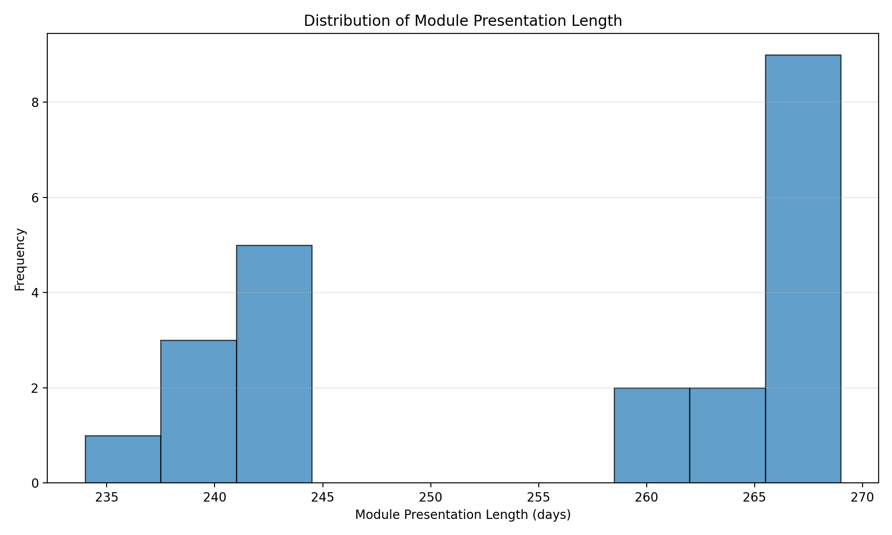
*Figure 1: Module presentation length distribution*

Therefore, a cutoff day of 14 weeks (or 98 days) has been applied. 

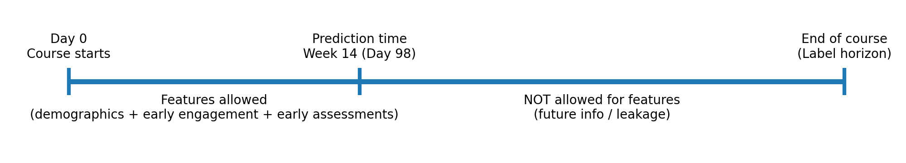
*Figure 2: Timeline indicating the cutoff day relative to course end dates*

In the development of the model, the availability date of feature data was **before** the cutoff in order to avoid temporal leakage (the issue of using data for prediction that's not available at the prediction time).

## 3. Classification Labels (Classes)

### 3.1. Risk Tiers

Risk tiers were derived from the final course outcome:

1. **Low Risk** for a *Pass* or *Distinction*  
2. **Medium Risk** for *Fail*  
3. **High Risk** for *Withdrawn*

### 3.2 Class Balance

Figure 3 shows the initial distribution of the risk tiers in the initial data (before any processing).

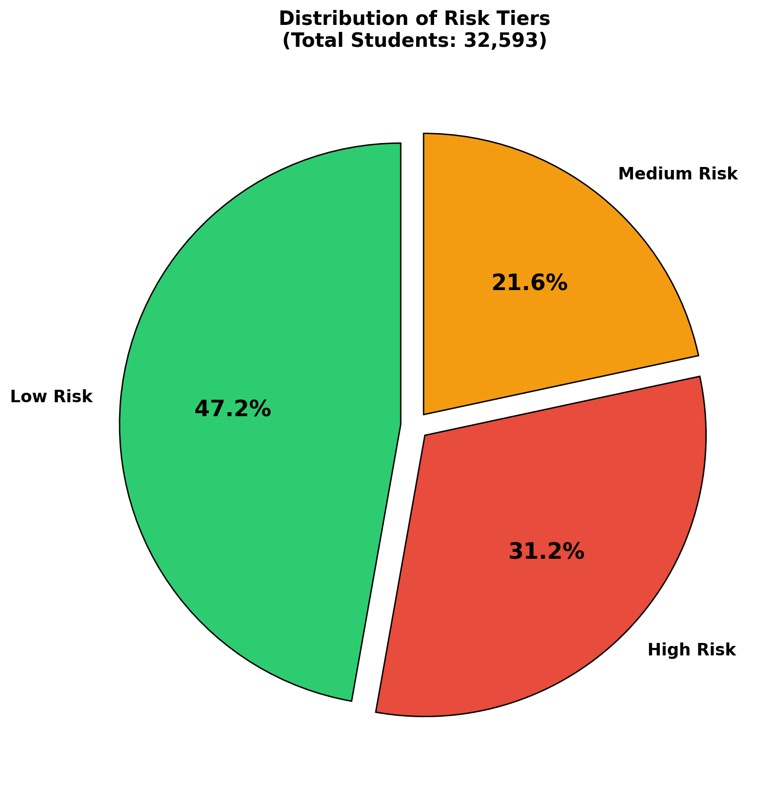
*Figure 3: Risk tier distribution (raw)*

This highlights the need for leakage handling given that the High Risk appears large because it includes students who withdrew throughout the entire course including ones within the prediction time (and some before the course start date). In most online courses, students withdraw in the first few weeks.

As a result, to prevent leakage, students who **unregistered by the prediction time** were excluded (**7,240 records removed**; remaining **25,353** enrollments).  

This significantly changes the class balance as shown in figure 4 below:

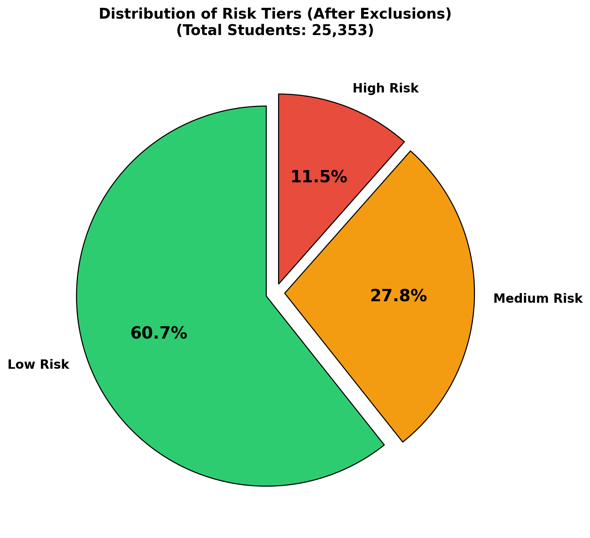
*Figure 4: The post‑exclusion distribution of Risk Tiers*

| Risk Tier   |   Students |   Percent |
|:------------|-----------:|----------:|
| Low Risk    |      15385 |     60.7% |
| Medium Risk |       7044 |     27.8% |
| High Risk   |       2924 |     11.5% |

As expected (based on common patterns with courses), the High Risk becomes the minority (about 11.5%), which directly explains why High Risk detection is the hardest part of the task.

#### Additional Resources:

- **Table 10** (`outputs/tables/table_10_imbalance_severity.csv`) lists the minority class and the level of imbalance which is moderate (although very close to 10% which would make it severe). 

## 4. Feature Engineering and Preprocessing

Several additional features were created based on the existing ones to better represent the problem space and address the following concerns:

### 4.1. Preventing Leakage

As illustrated in Figure 2 above, the cutoff day is the the reference for leakage control and was saved in the working solutions. The primary risk is that if post‑Day‑98 events enter the feature set, performance estimates become unrealistically since the solution will use "future data" that should not be available at prediction time.

The exclusion of early withdrawals is also part of leakage prevention since students who already withdrew by the cutoff day are not “predictable” at that time they are already known outcomes (nothing to predict about them).

### 4.2. Turning Online Activity (the VLE Clicks) Into Features

The learning managment syste, referenced as the VLE in OULAD, log of events were aggregated into features such as total clicks, clicks by activity type, engagement spread (active days), and variability.

Figure 5 shows which VLE type of activity drive the most engagement volume by students.

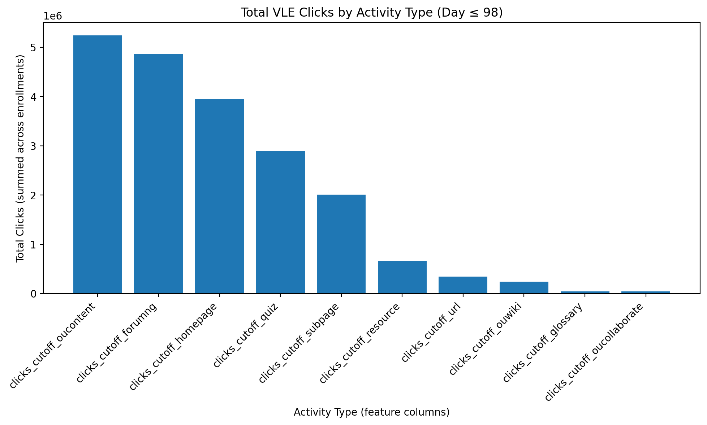
*Figure 5: Bar chart that shows which VLE type of activity drive the most engagement volume by students.*

Based on this, it is possible to see where students spend time (e.g., content pages, quizzes, forums) in the VLE and validates that the engagement patterns could be informative.

To further confirm this, figure 7 

### 4.3. Missing Data

Figure 6 plots the missing percentage for the different features used by the model and Table 12 quantify missingness by feature.

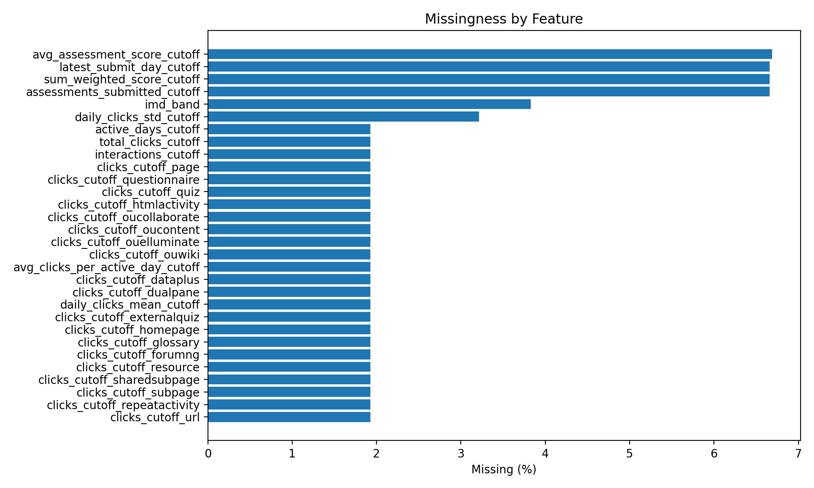
*Figure 6: Missingness by feature*

Althouhg only a handful of features have a significant amount of missing date (about 6%), these missing values influenced both model choice and preprocessing for this solution.

### 4.4. Engagement Distribution

Engagement indicators, such as clicks on different types of links, are typically long‑tailed on websites and in learning management systems such as the VLE (a scenario where a few students click a lot, many click little).

Figure 8 shows the distribution of the count of clicks by users by the cutoff day. Most users clicked less than 2000 times (from left to right).

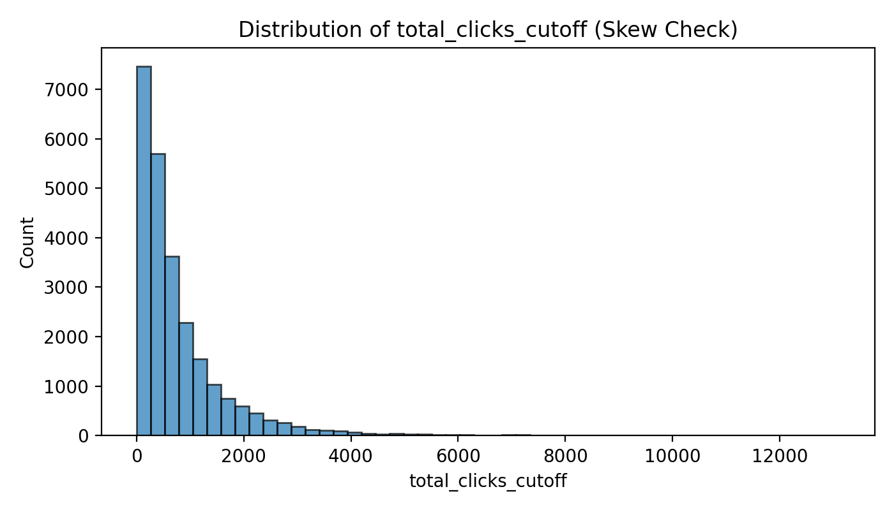
*Figure 8: Total clicks distribution (raw)*

To reduce the impact of extreme users (ones who clicked a lot or not at all), a logarithmic transformation was applied (*log* and a *log1p* which had similar results).

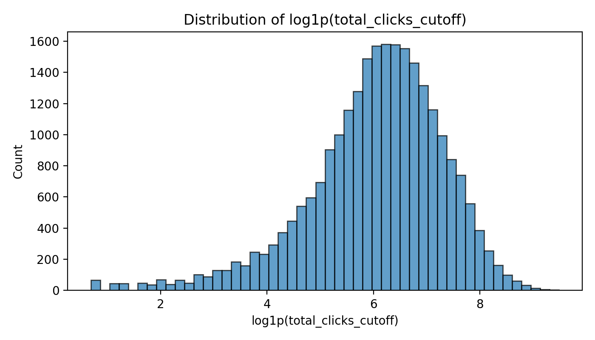
*Figure 10: Log1p total clicks distribution*

A pattern of engagement per tier is also visible based on the box plots of the clicks averages for each tier:

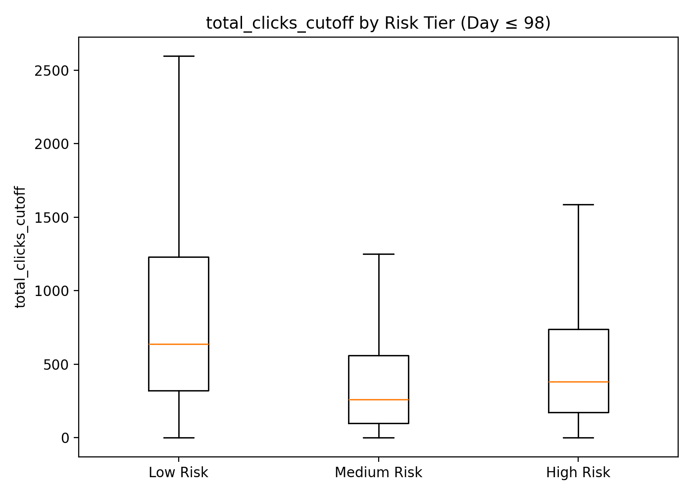
*Figure 7: Total clicks by risk tier*

The Low Risk is notably higher compared to the other two tiers. This implies that students who are at a Low Risk level are engaging more with the VLE (clicking more).

### 4.5. Assessment Performance (Mapped to Risk)

The distribution of average scores within the cutoff period is similar in nature to what is expected in online courses (and courses in general) which is more balanced.

*Figure 11: Average assessment score distribution*

When looking at the box plots for the average assessment score by Risk Tier, the differentiation between the Low Risk to the High and Medium Risks is noticeable in terms of a higher average.

However, it is important to note that the high risk group has marginally better scores compared to the medium risk.

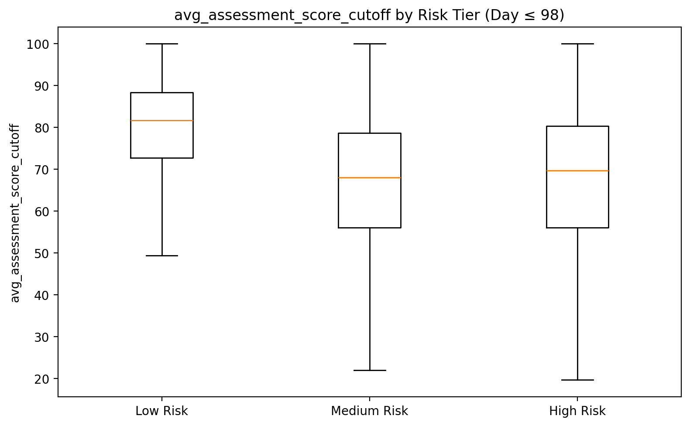
*Figure 12: Average assessment score by risk tier*

The plots show that early assessment performance is a high‑signal predictor while the lower early scores correlate with higher risk, supporting why assessment features appear among the top predictors later.

### 4.6. Correlation

Figure 13, representing a heatmap of correlation, as well as table 7 (`table_7_numeric_correlation_matrix.csv`) and table 8 (`table_8_sorted_correlation_pairs.csv`) show some clusters of correlation.

*Figure 13: Correlation heatmap*

There's a high likelyhood of redundant features:

- Most of highly-correlated features are related to the engineered features around clicks which make sense. However, they might be redundant.
- There's a correlation between the assessment related engineered features, which also makes sense since those are engineered based on the related features.

For the solution, with the best performing model, only a subset of the features were impactful (average clicks and assessment as will be shown in the evaluation section).

## 5. Modeling Approach

### 5.1. Baseline

Table 11 (`table_11_baseline_dummy_cv_train_only.csv`) shows the dummy baseline performance - essentially predicting a single class. This is the minimum prediction performance to exceed.

|   macro_f1_mean |   macro_f1_std |   balanced_acc_mean |   balanced_acc_std |
|----------------:|---------------:|--------------------:|-------------------:|
|           0.252 |              0 |               0.333 |                  0 |

The baseline predicts the majority class (Low Risk) for every record.

### 5.2. Models Applied

Two model that were compared are:

1. **Logistic Regression (Multimodal)** since it models all classes jointly in a single probability framework.

2. **Random Forest** since it uses an ensemble of decision trees that reduces overfitting by training many diverse trees and averaging their predictions, while still offering practical interpretability through feature-importance scores.

These models are more effective than others when dealing with imbalanced datasets that are similar to the OULAD one used.

| Metric | Random Forest (`rf_default`) | Logistic Regression (`logreg_default`) |
| :--- | :--- | :--- |
| **Macro-F1 (Mean)** | **0.4984** | 0.4557 |
| **Balanced Accuracy (Mean)** | **0.5122** | 0.4749 |
| **Precision Macro (Mean)** | **0.6118** | 0.5627 |
| **Recall Macro (Mean)** | **0.5122** | 0.4749 |
| **Fit Time (Mean)** | **6.62 seconds** | 15.14 seconds |

Based on these results, there are two key observations that stand out:

1. **Predictive Performance**  The **Random Forest** model achieved a higher Macro-F1 score (~0.50 vs ~0.46). Macro-F1 is a critical metric for evaluating performance across all classes, especially when handling potential class imbalances. 

2. **Computational Efficiency**  
Random Forest was significantly more efficient, with a mean fit time of 6.62 seconds, which is more than twice as fast as the 15.14 seconds required for Logistic Regression.

The **Random Forest** model is the superior choice in this comparison as it provides better predictive accuracy while requiring substantially less training time.

#### Additional Resources:

- Table 12 (`table_12_model_comparison_cv_train_only.csv`) shows the comparison between the models when running with default configurations.

### 5.3. Tuning Models

Hyperparameter tuning was then performed on both models. 

**Logistic Regression** 
For logistic regression, class weighting and regularization were explored.

**Random Forest** 
Changing the way the algorithm constructs the decisions trees by searching for the best settings for how the forest is built, so it generalizes better (especially on minority classes like your High Risk

#### Additional Resources:

- Table 13 (`table_13_logreg_gridsearch_cv_results.csv`) shows the top configurations for the Logistic Regression model.

- Table 14 (`table_14_rf_randomsearch_cv_results.csv`) shows the top configurations for the Random Forest model.

### 5.4. Selecting the Best Model

Table 15 (`table_15_baseline_vs_models_train_cv_summary.csv`) shows the best performance for each of the models applied in the solution (baseline, random forest default, random forest tuned, logistic regression default, and logistic regression tuned). 

| model               |   macro_f1_mean |   balanced_acc_mean |   precision_macro_mean |   recall_macro_mean |   fit_time_mean |
|:--------------------|----------------:|--------------------:|-----------------------:|--------------------:|----------------:|
| rf_tuned_best       |           0.562 |               0.567 |                  0.564 |               0.567 |         nan     |
| logreg_tuned_best   |           0.515 |               0.528 |                  0.517 |               0.528 |         nan     |
| rf_default          |           0.498 |               0.512 |                  0.612 |               0.512 |           6.374 |
| logreg_default      |           0.456 |               0.475 |                  0.563 |               0.475 |          16.185 |
| dummy_most_frequent |           0.252 |               0.333 |                nan     |             nan     |         nan     |

 
The selected model is the one that offers the best trade‑off between macro performance and operational practicality.

## 6. Performance on Held‑out Test Data ("Unseen Dataset" Representing Real-life)

### 6.1. Sanity Check

**Figure 14** shows that the train/test split preserves class proportions:

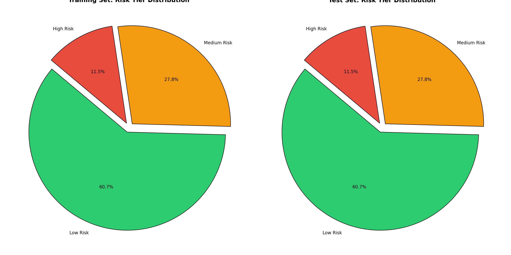
*Figure 14: Train vs test class distribution*

Details:

| risk_tier   |   train_pct |   test_pct |
|:------------|------------:|-----------:|
| Low Risk    |       60.68 |      60.68 |
| Medium Risk |       27.78 |      27.8  |
| High Risk   |       11.54 |      11.52 |

#### Additional Resources:

- The distribution is available in table 9 (`table_9_split_class_balance_pct.csv`):

### 6.2. Overall Performance on Test Dataset

Table 17 (`table_17_test_classification_report.csv`) provides the test‑set classification report:

| label        |   precision |   recall |   f1-score |   support |
|:-------------|------------:|---------:|-----------:|----------:|
| High Risk    |       0.249 |    0.353 |      0.292 |       584 |
| Low Risk     |       0.83  |    0.826 |      0.828 |      3076 |
| Medium Risk  |       0.631 |    0.529 |      0.576 |      1409 |
| accuracy     |       0.689 |    0.689 |      0.689 |         1 |
| macro avg    |       0.57  |    0.569 |      0.565 |      5069 |
| weighted avg |       0.708 |    0.689 |      0.696 |      5069 |

The macro averages reflect balanced performance across tiers (important under imbalance), while weighted averages reflect overall “average student” performance.

Based on precision and F1 score, the model performs well for "Low Risk" predictions, poorly on "Medium Risk", and very bad on "High Risk" (which is what matters most). Additional investigation is required to better understand the outcomes.

### 6.3. Confusion Matrix 

The confusion matrix shows which risk tiers are being confused, especially whether "High Risk" is being misclassified as "Medium and Low Risks".

Figure 15 shows the full 3‑class confusion matrix:

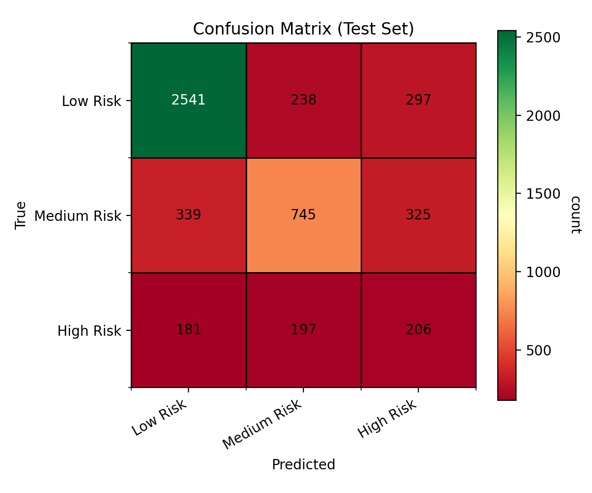
*Figure 15: Confusion matrix (test set)*

The numbers in the matrix are:

|   Predicted Low Risk |   Predicted Medium Risk |   Predicted High Risk |
|----------------:|-------------------:|-----------------:|
|            2541 |                238 |              297 |
|             339 |                745 |              325 |
|             181 |                197 |              206 |

The confusion matrices reveals the different types of errors, not just how many. For early‑warning systems, the costly error is often missing High Risk (known as false negatives).

### 6.4. Error Patterns

Table 22 (`table_22_misclassification_pairs_test.csv`) summarizes the largest misclassification pairs (where the model got it wrong):

| true        | pred        |   Count |
|:------------|:------------|--------:|
| Medium Risk | Low Risk    |     339 |
| Medium Risk | High Risk   |     325 |
| Low Risk    | High Risk   |     297 |
| Low Risk    | Medium Risk |     238 |
| High Risk   | Medium Risk |     197 |
| High Risk   | Low Risk    |     181 |

Based on the table, the model most often confuses Medium Risk with Low Risk and High Risk with Medium Risk. This suggests a “boundary fuzziness” between adjacent tiers. However, the differences aren't significant with mixing Low and High risk, which are not adjacent.

These results suggest that the predictability of the "High Risk" as a factor of withdrawals based on the dataset is difficult (or at the very least not simple).

### 6.5. High Risk Focus

Because High Risk is the priority intervention group, we also examine “High Risk vs Rest” which refers to exploring the Low and Medium risk combined as a group.

#### ROC Curve

This ROC curve in figure 19 represents the “High Risk vs. everyone else” on the test set, and it shows the model has some ability to separate High Risk learners from non-High Risk learners, but it is not strong.

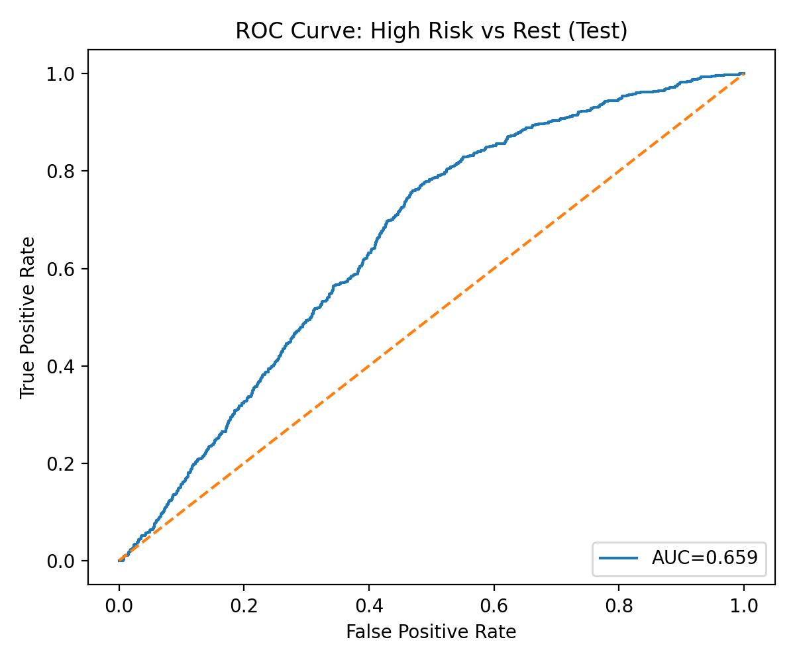
*Figure 19: ROC curve (High Risk vs rest)*

Insights:

- The curve sits above the diagonal “random guessing” line, which means the model ranks High Risk cases higher than non-High Risk cases more often than chance.

- The AUC = 0.659 means that, if you randomly pick one High Risk learner and one non-High Risk learner, the model will assign a higher risk score to the High Risk learner about 66% of the time. That’s better than a coin flip, but far from excellent.

#### PR Curve

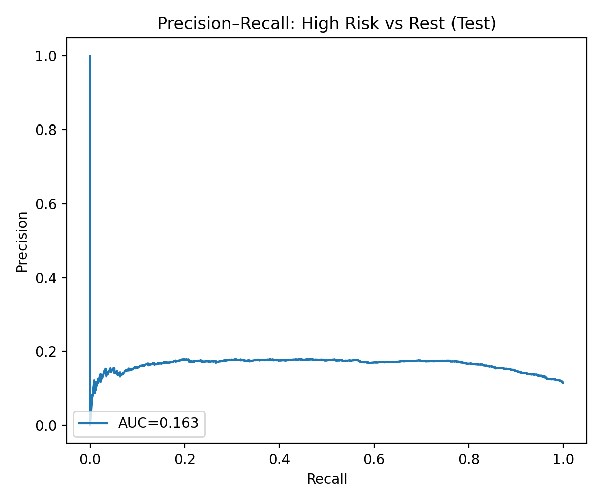
*Figure 17: Precision–Recall curve (High Risk vs rest)*

This shows that even with adjusting the threshold to catch more "High Risk" records, the proportion of flagged students doesn't improve much beyond random selection (about 0.11).

The AUC values:

| curve                       |   value |
|:----------------------------|--------:|
| ROC AUC (High Risk vs Rest) |   0.659 |
| PR AUC (High Risk vs Rest)  |   0.163 |

**Significance:** PR AUC is especially important when High Risk is rare—precision is the cost of outreach effort; recall is the cost of missing students who need help.

---

## 7. Feature Importance (Interpretability)

The top features by importance for the model are:

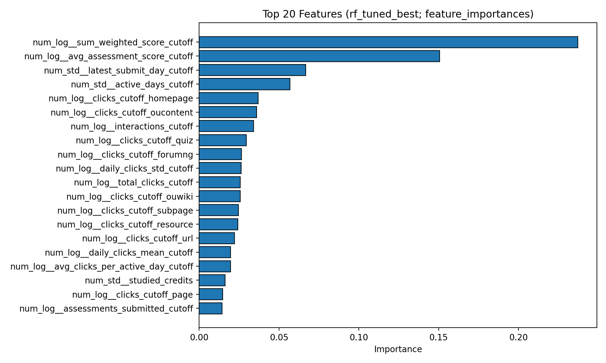
*Figure 18: Top features of best model*

And as a table:

| Feature                              |   Importance |
|:-------------------------------------|-------------:|
| Sum weighted score cutoff   |        0.237 |
| Avg. assessment score cutoff |        0.151 |
| Latest submit day cutoff    |        0.067 |
| Active days cutoff          |        0.057 |
| Clicks cutoff homepage      |        0.037 |
| Clicks cutoff OU content     |        0.036 |
| Interactions cutoff         |        0.034 |
| Clicks cutoff quiz          |        0.03  |
| Clicks cutoff forumn        |        0.026 |
| Daily clicks std. cutoff     |        0.026 |

The leading predictors are **assessment performance** and **engagement intensity/consistency** (e.g., total clicks, active days, last submit timing). This aligns with domain intuition: students who submit less, later, and engage less tend to be at higher risk.

Details:

- `sum_weighted_score_cutoff` (0.237) and `avg_assessment_score_cutoff` (0.151) are the most important features. These features are also related (correlation matrix and logic).

- `assessments_submitted_cutoff` (0.014) also matters and shows that students who submit more assessments by the cutoff generally do better.
- Most of the features have limited to no contribution. 

#### Additional Resources:

- Table 23 (`table_23_feature_importance_best_model.csv`) for the full listing of important features (sorted).

## 8. Strengths and Limitations 

### 8.1. Strengths
- Strong improvement over baseline on macro performance (Section 1).
- Uses an explicit leakage cutoff (Figure 2), supporting realistic deployment evaluation.
- Feature importance aligns with meaningful learning behaviors (Section 7), improving trust.

### 8.2. Limitations (most important)
- **High Risk remains challenging:** minority class + overlapping behavior patterns with Medium Risk (Tables 20–22).  
- **Label definition:** High Risk = Withdrawn. Withdrawal can reflect external life constraints, not only learning difficulty—risk tiers can encode structural inequities.
- **Generalization risk:** this is one dataset context; feature importance and thresholds may shift across courses or semesters.

## 9. Ethical Considerations

This model is meant to help students, not tp penalize them (especially given that the performance is not good for the higher risk levels). It predicts a risk tier (Low / Medium / High) based on early-course behavior and performance, so staff can decide who might need support sooner.

- **Fairness and bias:** Demographic attributes can correlate with risk outcomes.  

- **Transparency:** It is of critical importance to communicate that predictions are based of probabilities and based on early engagement signals from past learners which may not reflect on the current cohort. 

- **Human‑in‑the‑loop:** Decisions should not be automated using this solution without a review by a human (at least not in the current performance state of the model).

## 10. Recommendations and Next Steps

Based on the insights from this project, the actions listed below are the most useful next steps that are recommended for making the model more practical and improve performance (especially for High Risk learners).

1. **Use the model as a prioritized triage list.**  
Use the predictions to create a ranked outreach list rather than treating them as final labels, so the highest High Risk probabilities are reviewed first (e.g., the top 20 students today) and have low-probability cases monitored with lighter-touch supports (e.g., an automated check-in message).

2. **Do not assume all courses are the same.**  
In this solution, the dataset included all student records, who had feature details that fit the criteria, across all listed course (22). The underlying assumption that behaviors and risk levels are similar across every type of course are likely not as accurate as treating each course as a separate dataset.

3. **Change the Classes to exclude Withdraw.**  
Throughout the exploration and evaluations stages, the behavior of students who withdraw from a course is not easily distinguished from students who do well or poorly in the course. Focusing on identifying students who are struggling or are likely to be less engaged may yeld better results. 

The general methodology and approach for the solution would be similar, other than classifying the risk levels based on final grade ranges and perhaps engagement levels (which seem to correlate with lower performance.)

4. **Improve features using trend signals to separate Medium vs High Risk.**  
Add time-based trend features because they capture direction, not just totals, such as week-over-week declines in clicks, repeated weeks with no activity, or worsening submission timing (e.g., late submissions increasing or missing two weeks in a row).

This coupled with better fitted cutoff periods for individual courses could be a more effective approach. 

5. **Run fairness checks for subgroups.**  
Report performance across relevant subgroups to detect disparities, such as disability status, age bands, education level, or IMD band (and gender if appropriate), and review whether some groups have much lower High Risk recall (more missed at-risk learners) or much higher false positives (more unnecessary flagging) so you can consider safer feature choices, re-weighting, or clearly documented limitations.

6. **Monitor performance over time and retrain when drift appears.**  
Track whether accuracy, macro-F1, and High Risk recall change across new cohorts or course redesigns, and schedule retraining when metrics drop (e.g., after a new term launch or major assessment changes) to prevent the model from becoming stale.

The dataset is relatively old (updated 6 years ago), and in the past few years with the emergence of AI, the rise in popularity of online courses, and market changes globally - it is likely that some patterns and motivations that learners have may have changes or will change over time.
